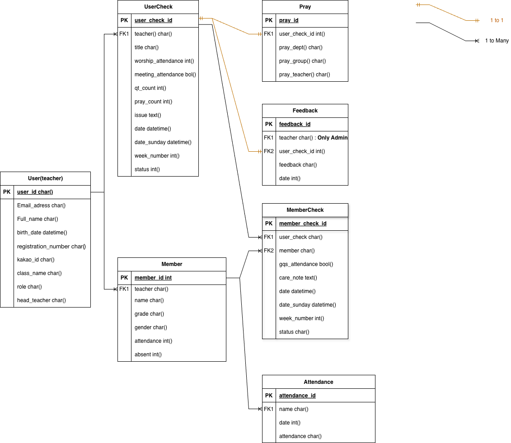

# 

## Overview

poko is a web application project built with a React-based frontend and a Django-based backend.  
It was designed to solve problems related to attendance management and pastoral / child care reporting.  
The project adopts a Docker-based environment to ensure consistency across development and deployment.

---

## 概要

poko は、React を用いたフロントエンドと Django を用いたバックエンドで構成された
Web アプリケーションです。
出席管理および育成・記録業務の課題を解決することを目的として設計されており、
Docker を用いて開発・デプロイ環境を統一しています。

---
## Features
- **User Authentication**: JWT-based authentication for secure login and role-based access control
- **Social Login (Kakao)**: Kakao OAuth integration with JWT-based authentication flow
- **Student Management**: Attendance tracking and pastoral / child care report management
- **Admin Dashboard**: Centralized dashboard for administrators to monitor and manage data
- **RESTful API**: RESTful API design and implementation using Django REST Framework
- **Dockerized Environment**: Containerized development and deployment using Docker on AWS Lightsail
---

## Tech Stack

### Frontend
- React
- JavaScript
- Axios

### Backend
- Python
- Django
- Django REST Framework

### DB / Cache
- PostgreSQL

### Server / Deployment
- Docker
- Docker Compose
- Nginx
- AWS Lightsail

### OS
- Linux (Ubuntu)

### Tools / Test / Productivity
- Pycharm
- Visual Studio Code
- Git

### Collaborations
- Git
- Notion

---

## Project Structure

- frontend : React-based frontend application and user interface

- backend : Django-based backend API server and business logic

- docker : Docker and Docker Compose configuration for development and deployment

---

## Database Design (ERD)

The database is designed around weekly reports and student records.
- User (Teacher) → UserCheck (Weekly Report) → MemberCheck (Per Student Report)
- Member → Attendance (History)

## Related Links
- Velog  
  https://velog.io/@uiseoo/series/Hello-Poko-Ver.3
